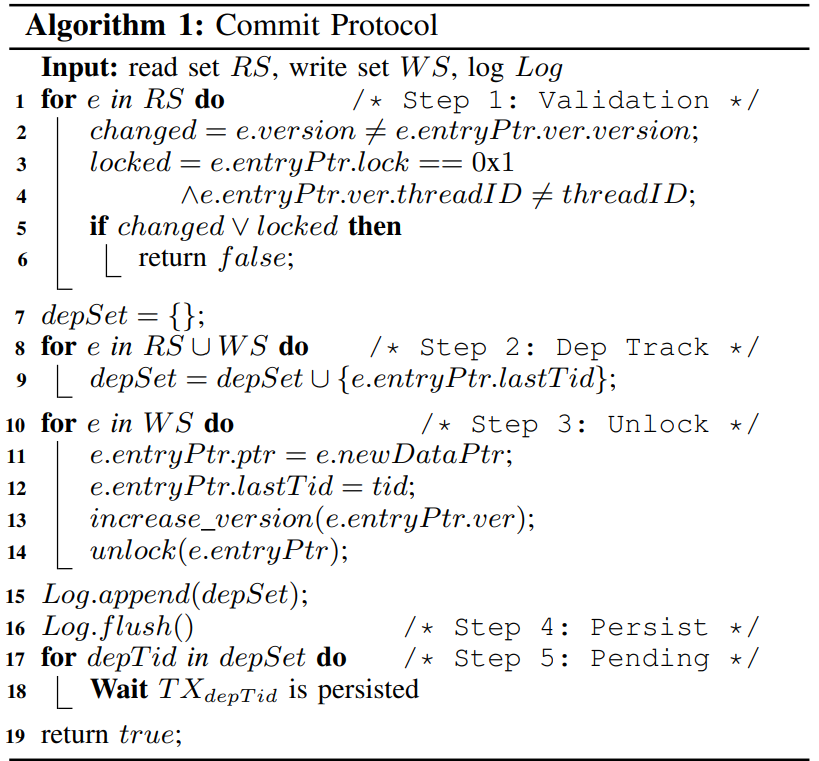

### 1、Improving the Concurrency Performance of Persistent Memory Transactions on Multicores

#### 1.1、本文提出了一种SP3的策略来降低PM内存事务在多核时的并行执行效率。

#### 1.2、本文用实验结果说明了PM内存事务可持久化操作的矛盾，所以提出的SP3用来预测从而能让事务的可持久化并行执行。

#### 1.3、SP3主要采用两个协议commit protocol 和 recovery protocol 来保证降低持久化冲突以及错误恢复功能。

#### 1.4、commit protocol 如下所示：

#### 1.5、recovery protocol 是通过构造DAG图，使用拓扑排序来实现错误的重新运行恢复。

### 2、