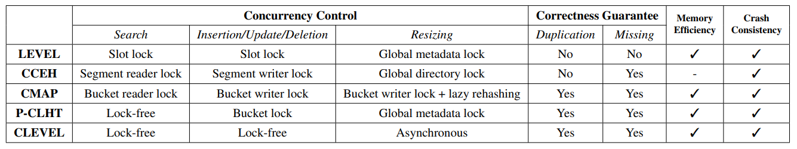

### 1、Lock-free Concurrent Level Hashing for Persistent Memory

#### 1.1、本文给出了一种多级的无锁的hash结构来保证在并行系统中的重新调整大小和各种访问请求(增删改查)的高效率。

#### 1.2、下面是作者列举的现有的索引结构：

- **Level hash** 是指使用两层hash结构，上层是下层的两倍大小。当需要resize时，只需要再增加一层大小为当前上层两倍的结构，然后将当前下层重新hash到新的一层，再把当前下层删去，这样就能将每次resize的hash次数减少到原来的1/3。但是level hash 的resize是当线程的，并且需要全局锁来保证正确性。
- **P-CLHT**是Cache-Line Hash Table (CLHT)的变种，其search操作是lock-free。其resize操作需要rehash所有元素，并且会阻塞其他进程直到resize完成。
- **Cacheline-Conscious Extendible Hashing (CCEH)**是持久化的可扩展hash模式，支持基于锁的动态resize，但是其粗粒度的锁会极大地增加共享资源的延迟。具体地说，它将1024个slot分为一个segment，加锁时为每个segment加写锁。而且，当其目录需要resize时，需要全局写锁。CCEH的CoW版本可以避免segment lock，但是会增加额外的写代价。
-  **concurrent_hash_map (cmap)**是pmemkv的开源并行hash_map实现。cmap利用lazy rehash 将数据迁移缓冲到之后的访问中。但是之后的延迟的开销可能会聚集递归执行在某些访问中，导致了访问性能的不确定性。
- 

#### 1.3、作者提出的Clevel hashing 模式主要解决以下两个问题：

- 改善resizing过程中性能的下降。（通过设计多级hash解决）
- 基于锁的并发控制的可扩展性太差。（通过设计无锁并发控制解决）

#### 1.4、无锁机制下的resizing 以及 增删改查

* **resizing** 
  * 将context的全局指针复制到本地。(也算是更新本地的context指针)
  * 通过context指针，使用CAS策略来将new level加入到linked list中。如果未成功，就说明是其他线程已经新创建了new level 并加入了linked list，更新context继续下一步。
  * 使用CoW+CAS去更新context中的first level，并将is_resizing置为true。如果未成功，检查新的first level 的大小是否不小于之前创建的new level的大小，如果不是，重新使用CoW+CAS更新。
  * 将last level 的转移到 first level。首先通过CAS将item pointer 复制到first level 的候选bucket中，如果失败了，寻找另一个候选bucket，再失败了，返回第二步，重新expand first level 大小；否则将last level 中的item pointer 直接删除即可。
  * 当rehashing 完成时，使用CoW+CAS去更新context。如果未成功，并且last level并未修改，重新使用CoW+CAS更新。
* **search**
  * 采用tag机制提高访问的效率
  * 采用b2t（bottom to top，从 last level 到 first level）遍历顺序
* **insert**
  * 首先采用一遍b2t遍历查看当前表中是否具有相同元素，如果有，则拒绝插入
  * 在插入之前判断，is_resizing为true以及插入的位置为last level 时，重新选择位置
  * 在插入后发现插入的是last level 并且在插入开始后 resizing 开始了，这时候需要reinsert
* **update**
  * 先进行一遍b2t遍历查找更新元素，若有重复元素则删去，留下level 较前的元素进行更新。
  * 此时可能会出现更新失败，因为有可能存在线程在进行rehashing操作，当 resize = true && updated item in last level && 更新后 rehashing ID > updated ID,此时需要再执行一次update。
* **deletion**
  * 先进行一遍b2t遍历删除元素
  * 如果在删除过程中，有last level元素并且也满足resize = true && deleted item in last level && 删除后 rehashing ID > deleted ID，则再进行一次deletion操作。

### 2、Efficient Multi-Grained Wear Leveling for Inodes of Persistent Memory File Systems

#### 2.1、作者提出了使用双重粒度的磨损平衡机制来提高Inode的磨损均衡以此来提高Inode模块中PM的寿命。

#### 2.2、Inode的大小为128B。作者观察到Inode的频繁更新单元小于64B，可以将一个Inode分为两个64B大小。最先进的Inode磨损机制并没有利用到这一点，其他的磨损均衡策略都是基于128B整体进行数据迁移的。

#### 2.3、由此，作者提出了粗细粒度的多重磨损均衡策略。作者将一个Inode page设置为32个Inode的大小，也就是64 * 64B的大小。在一个Inode page内使用细粒度磨损均衡策略，在不同Inode page之间使用粗粒度磨损均衡策略。

