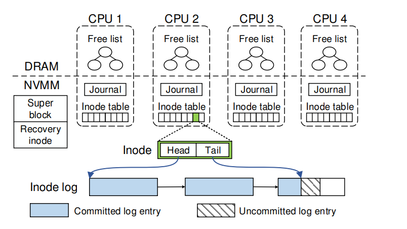
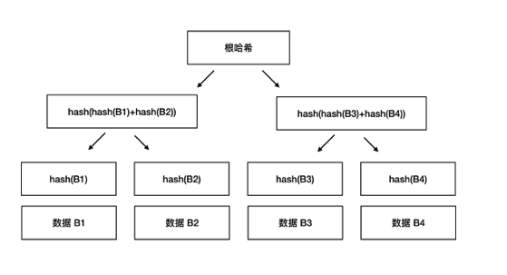

### 1、NOVA: A Log-structured File System for Hybrid  Volatile/Non-volatile Main Memories

#### 1.1、本文作者提出了几点当前文件系统对于采用NVMM设备具有的挑战。

- **在性能方面**，由于以前的文件系统软件开销远小于硬件开销，所以软件产生的开销都忽略不计。但是NVMM的访问速度远超于磁盘访问速度，已经接近于内存的速度，所以传统的文件系统中的软件开销会抵消掉一些NVM的速度优势，对此，应该优化传统文件系统在NVMM上的软件开销。
- **在写入顺序方面**，现代处理器都会对写入操作进行重新排序以达到更好的性能，但是大部分系统都没有保证在这种改变顺序的情况下，内存的故障一致性。NVMM软件可以使用常见的clflush来严格强制顺序，但是使得缓存行失效会导致一个不必要的开销，并且该命令只是发送数据给内存控制器，不保证能到达内存。clwb就能让缓存行回写并且不使得缓存行失效。mfence能保证在该语句前的操作全部执行完才开始语句之后的操作，但是它不保证之前的操作的顺序。PCOMMIT是强制存储NVMM的命令。
- **在原子性方面**，存储系统常常提供较弱的原子性。磁盘提供扇区写入原子性，而处理器提供8字节写入的原子性。而为了让文件系统拥有更复杂的原子性，我们就必须采用更复杂的机制。

#### 1.2、基于以下三个观察，作者提出了一种新的文件系统NOVA，是一种NVMM友好的log-structed 文件系统。

- 支持原子性更新在NVMM中是很容易做到的，但是它们在搜索操作效率都不高（例如目录查找表和文件内随机访问）。相反地，能支持快速搜索的数据结构在NVMM中很难有效率且正确地实现。
- 清理日志的复杂源于需要提供连续的空闲存储区域，但在NVMM可以不是必要的，因为NVMM的随机访问很快。
- 之前使用的日志集中放置在磁盘上具有单个磁盘头访问并且增加其局部性，但是这严重影响了并发性。因为NVMM快速随机访问和高并发使得这一集中式日志的优势不复存在，所以可以使用多个日志存放点。

#### 1.3、NOVA文件系统具有以下五个特点：

- **让文件日志和数据放在NVMM中，让索引放在DRAM中**。在DRAM中使用基数树来快速检索，使得NVMM中的数据结构更简单高效。
- **NOVA 中的每个 inode 都有自己的日志，允许跨文件并发更新而无需同步**。这种结构允许在文件访问和恢复期间实现高并发，因为 NOVA 可以同时访问运行多个日志。NOVA通过保证有效日志条目的数量来保证扫描日志的速度。
- **对于一些复杂的原子性更新使用logging和轻量级journaling**。NOVA采用的是log-structed因为该数据结构提供了比影子分页和journaling更小的开销。当需要更新日志时，只需要原子地更新指针地指向即可，不需要额外的代价。当文件需要在目录中转移时，需要操作不止一个inode节点，这时候需要采用journaling来保证更新原子性。该journaling是很轻量级的，因为一次移动只记录日志尾指针，并且其记录的个数不会多余四个。
- **将日志的数据结构设置为单链表**。因为在NVMM中，顺序日志局部性的优势已经没那么重要了，所以NOVA将使用4KB的大小页来存放日志和下一节点的指针。对于非顺序的日志存储，还有以下几点好处：
  - 分配日志空间很容易，不需要分配大的连续的空间。
  - NOVA可以对日志进行细粒度的清理。
  - 回收日志页很方便，只需要修改少量指针。
- **不需要使用日志记录文件数据**。在进行修改文件数据时，先使用原子性的元数据日志修改来记录此次更新及指向更新页的指针，然后再使用copy on write更新文件数据。使用copy on write有以下好处：
  - 使得日志文件更少，可以加速恢复的过程。
  - 使得日志的回收更加简单高效，因为不用将日志中复制文件数据来回收日志。
  - 添加和删除数据页都是十分简单的，因为只需要再DRAM中的free lists 中进行修改即可。
  - 因为能立即回收旧页，所以能使得NOVA在高写入负载和高利用率情况下也能保持性能。

#### 1.4、NOVA整体架构：



其中Free list、Journal、Inode table 是per-CPU结构的，以便能有更好的扩展性。

### 2、Merkle Tree 简介

#### 2.1、merkle tree 就是用来做完整性校验的，所谓完整性校验，即为检查数据是否损坏或被恶意篡改。

#### 2.2、以下介绍完整性校验的由来和解决方法的发展过程。

- **hash**。实现完整性校验，最简单的方法就是对要校验的整个的数据文件做个哈希运算，把得到的哈希值公布在网上，这样我们把数据下载到手之后，再次运算一下哈希值，如果运算结果相等，就表示我们下载过程中文件没有任何的损坏。因为哈希的最大特点是，如果数据稍微变了一点点，那么经过哈希运算，得到的哈希值将会变得面目全非。没有人可以把数据篡改了，同时还能保证数据的哈希不变。**这种简单的采用哈希的方式做数据运算，比较适合数据本身不做分割，同时是放在一台服务器上的情况**。

- **Hash List**。在对等网络中，数据往往是拆分成很多碎片去下载的，当一个碎片不可靠却下载整个数据是完全不必要的。故而产生了Hash list，它能把每个碎片都进行对比，如果有一个小块数据在传输过程中损坏了，那我只要重新下载这一个数据块就行了。为了保证hash list 的可靠性，我们需要一个根hash，来校验哈希列表中的每一个哈希都是正确的，进而可以保证下载的每一个数据块的正确性了。

- **Merkle Tree**。在最底层，和哈希列表一样，我们把数据分成小的数据块，有相应地哈希和它对应。但是往上走，并不是直接去运算根哈希，而是把相邻的两个哈希合并成一个字符串，然后运算这个字符串的哈希，这样每两个哈希就结婚生子，得到了一个”子哈希“。如果最底层的哈希总数是单数，那到最后必然出现一个单身哈希，这种情况就直接对它进行哈希运算，所以也能得到它的子哈希。于是往上推，依然是一样的方式，可以得到数目更少的新一级哈希，最终必然形成一棵倒挂的树，到了树根的这个位置，这一代就剩下一个根哈希了，我们把它叫做 `Merkle Root`。

  

#### 2.3、merkle tree 的简单实现，添加和删除节点在不同的实现场景中具有不同的限制，故代码未实现添加删除节点功能。

````java
package com.goroom.merkle;
 
import java.security.MessageDigest;
import java.util.ArrayList;
import java.util.List;
 
/**
 * Created by andyfeng on 2017/12/20.
 */
public class MerkleTrees {
    // transaction List
    List<String> txList;
    // Merkle Root
    String root;
 
    /**
     * constructor
     * @param txList transaction List 交易List
     */
    public MerkleTrees(List<String> txList) {
        this.txList = txList;
        root = "";
    }
 
    /**
     * execute merkle_tree and set root.
     */
    public void merkle_tree() {
 
        List<String> tempTxList = new ArrayList<String>();
 
        for (int i = 0; i < this.txList.size(); i++) {
            tempTxList.add(this.txList.get(i));
        }
 
        List<String> newTxList = getNewTxList(tempTxList);
 
        //执行循环，直到只剩下一个hash值
        while (newTxList.size() != 1) {
            newTxList = getNewTxList(newTxList);
        }
 
        this.root = newTxList.get(0);
    }
 
    /**
     * return Node Hash List.
     * @param tempTxList
     * @return
     */
    private List<String> getNewTxList(List<String> tempTxList) {
 
        List<String> newTxList = new ArrayList<String>();
        int index = 0;
        while (index < tempTxList.size()) {
            // left
            String left = tempTxList.get(index);
            index++;
            // right
            String right = "";
            if (index != tempTxList.size()) {
                right = tempTxList.get(index);
            }
            // sha2 hex value
            String sha2HexValue = getSHA2HexValue(left + right);
            newTxList.add(sha2HexValue);
            index++;
 
        }
 
        return newTxList;
    }
 
    /**
     * Return hex string
     * @param str
     * @return
     */
    public String getSHA2HexValue(String str) {
        byte[] cipher_byte;
        try{
            MessageDigest md = MessageDigest.getInstance("SHA-256");
            md.update(str.getBytes());
            cipher_byte = md.digest();
            StringBuilder sb = new StringBuilder(2 * cipher_byte.length);
            for(byte b: cipher_byte) {
                sb.append(String.format("%02x", b&0xff) );
            }
            return sb.toString();
        } catch (Exception e) {
            e.printStackTrace();
        }
 
        return "";
    }
 
    /**
     * Get Root
     * @return
     */
    public String getRoot() {
        return this.root;
    }
}
````

测试：

```java
package com.goroom.merkle;
 
import java.util.ArrayList;
import java.util.List;
 
/**
 * Created by andyfeng on 2017/12/20.
 */
public class App {
    public static void main(String [] args) {
        List<String> tempTxList = new ArrayList<String>();
        tempTxList.add("a");
        tempTxList.add("b");
        tempTxList.add("c");
        tempTxList.add("d");
        tempTxList.add("e");
 
        MerkleTrees merkleTrees = new MerkleTrees(tempTxList);
        merkleTrees.merkle_tree();
        System.out.println("root : " + merkleTrees.getRoot());
    }
}
```

