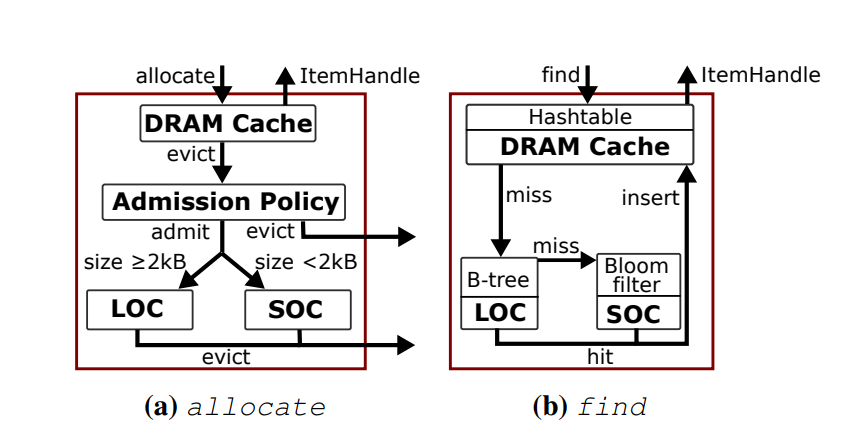
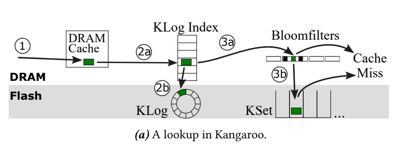
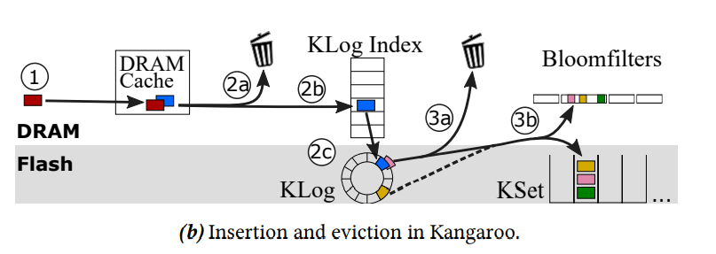

### 1、The CacheLib Caching Engine: Design and Experiences at Scale

#### 1.1、本文提出一个通用的cache引擎CacheLib，解释了在规模上的设计和经验。

#### 1.2、通用cache引擎的提出是顺应需求而生的。在web 服务器上的cache越来越多，同时其开发和维护的成本也越来越高。尽管cache一直以来都被设计为专用的，但是他们仍然在很多方面具有共同点，所以为其作一个cache引擎已成为必要之举。

#### 1.3、文中列举了一系列的专用cache：

- **Hierarchical and geo-distributed caches.**CDN服务器
- **Application look-aside caches.**应用程序缓存
- **In-process caches.**进程内缓存
- **Machine-learning-model serving systems.**机器学习服务系统缓存
- **Storage-backend cache.**后端存储缓存
- **Database page buffer.** 数据库页面缓存

#### 1.4、实现通用cache引擎所需要面临的挑战：

- **Massive Working Sets。**工作集大导致普通容量小的DRAM的命中率表现不够好，工作集的大小主要体现在热度分布以及流失率变化。
- **Size Variability。**专用cache的存储单元一般都比较具体，故设计其大小较易，但是通用cache引擎需要存储各种各样的信息，其单元大小具有变化性。
- **Bursty Traffic。**存在大型web服务公司中的cache经常会有突发的流量，需要考虑应对。
- **Resource Management。**为了让缓存充分地利用资源，开发了资源管理，能更有效率地利用资源并且在资源不够时防止系统崩溃（OOM）。
- **Computationally Costly Query for Empty Results。**一般cache对结果为空的查询的代价太大，没有进行优化。
- **Updating Cached Data Structures。**可以具有快速更新cache内部数据结构的能力，不需要进行反序列化和序列化的过程。
- **Frequent Restarts。**缓存设备可能会经常重启，需要有一定的措施减轻对cache命中率的影响。

#### 1.5、通用Cache引擎的设计与实现

- **Thread-safe cache primitives。**线程安全的缓存原语
- **Transparent hybrid caching。**混合cache系统对应用程序透明
- **Low resource overhead。**低资源使用开销
- **Structured items。** 本地化的结构化的项（例如数组及映射）
- **Dynamic resource monitoring, allocation, and OOM protection。**动态的资源监视、分配以及保护
- **Warm restarts。**热重启

#### 1.6、实现的架构

#### 1.7、思考与建议

- 在DRAM和Flash的结构中加入NVM结构，用来横向或纵向集成。
- 在DRAM中驱逐的项是否加入Flash可以采用策略依照值（次数/时间）作为比较对象进行判断其是否要进入Flash里面。
- DRAM中的slab classes的设置问题是未提出解决方案的。

### 2、Kangaroo: Caching Billions of Tiny Objects on Flash

#### 2.1、本文提出的Kangaroo具有以下特点：

- 针对于大量小型的存储结构设计的采用DRAM和flash集成的缓存。
- DRAM的数量很少并且也能很大程度上减少flash的写入放大和读取时间。

#### 2.2、Kangaroo的整体架构：

- 采用分层次的结构，分DRAM和Flash层。其中Flash又分成KLog和KSet
- 如下图所示：

#### 2.3、设计方法

- **KLog设计思路**
  - 采用log-structed的方式，使用一个in-DRAM的内存来进行缓存一个segment的内容，当缓存满了再写入flash中。
  - 将由KSet产生（key set）将KLog分为不同的partition，每个partition中内含一个hash table来映射除partition外剩下的key set，hash table存放在内存中，不仅指明了地址，还说明了其对应key值剩下位的tag。
  - 当查询时，先通过key set查看在哪个partition，进而找到其hash table， 接着进行in-DRAM的tag比对，tag相同才读取KLog的flash模块。查询成功时，需要修改元数据RRIP中的标志。
  - 进行插入时，首先在hash table 中创建一个bucket对应这key set，然后将内存添加进去 in-DRAM buffer中，一旦buffer满了，就会被写入flash中。
  - hash table 可以对相同key set进行 ENUMERATE-SET（key set）迭代查询。
  - KLog 驱逐到 KSet 中的策略：设置threshold为n，当buffer满了时，如果 SIZE（ENUMERATE-SET（key set））小于n，则drop 该key set。
- **KSet设计思路**
  - 首先采用set-associate方法产生（key set）将小对象（100B）映射在对应的page中（4KB）。
  - 其次采用RRIP算法来evict，和FIFO一样不会增加写放大且不需要像LRU算法一样的大DRAM。
    - RRIP是一个多时钟算法，采用三位来记录一个对象的使用情况。当为（000）时，对象是near reuse，i.e. 靠近再次使用，不应该被驱逐；当为（111）时，对象是far reuse，i.e.远离再次使用，应该被驱逐。
    - 当对象被再次访问时，它的RRIP被重置为（000）；当新的对象被插入时，其RRIP被置为（110），以便不让冷数据停留过长时间，也不至于让热数据被驱逐，这是一个tradeoff的值。
    - 一个对象的RRIP被修改只有在insert，access时才会被修改。为了减少读放大，当access时，使用一位bit记录对象是否被访问过，当insert时，再对其进行修改。

