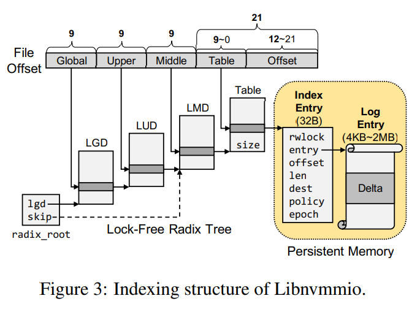

### 1、Libnvmmio: Reconstructing Software IO Path  with Failure-Atomic Memory-Mapped Interface

#### 1.1、本文作者提出了基于NVM优化的文件系统Libnvmmio，是采用了内存映射接口（mmap）来提供IO服务，并保证了故障一致性（msync）。

#### 1.2、内存映射 IO 和读写 IO 之间的根本区别在于数据路径。读写接口将用户缓冲区复制到内核缓冲区中，搜索文件系统索引以定位物理块地址，并在必要时执行元数据操作。而内存映射接口允许直接访问存储，跳过索引搜索并复制到内核缓冲区。与读写接口相比，内存映射 IO 中简化的数据路径大大降低了软件开销，从而显着提高了快速非易失性内存中的 IO 性能。

#### 1.3、一般保持原子性有两种方法。一个是使用日志，另一个是采用copy on write。Libnvmmio通过透明地拦截文件 API，并通过使用日志记录为数据操作提供原子性。

#### 1.4、Libnvmmio采用了一种独特的数据存储机制，采用以数据为中心，为每个块构建日志与元数据，而不是基于线程或者事务。当多个线程同时访问时，这种细粒度锁的优势就得以显现。每个块的日志元数据采用基数树才查询，基数树的结构如下所示：

#### 1.5、Libnvmmio 可以透明地将应用程序的读写替换为内存映射的 IO 操作，通过mmap接口来提供原子性。文中说明原子性的代价十分昂贵，有些请求完全可以不需要原子性，比如临时文件的IO。文中说明是否需要原子性可以由开发人员指定，但是并没有实现自动检测其是否原子性。

