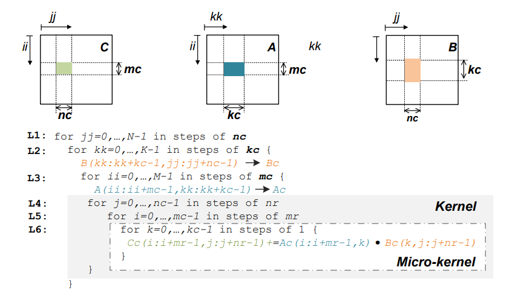
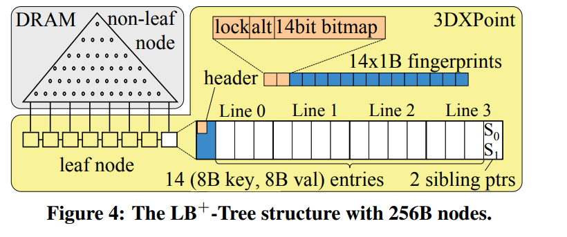

### 1、LibShalom: Optimizing Small and Irregular-shaped Matrix Multiplications on ARMv8 Multi-Cores

#### 1.1、通过在ARMv8多核系统中优化小矩阵和不规则矩阵的乘法运算。

#### 1.2、GEMM（C = 𝛼A ·B + 𝛽·C）是一种矩阵乘法累加运算，通用算法如下所示：

#### 1.3、作者对以下三方面进行优化：

- packing overhead 过大。
- 对于edge strategies 的优化。
- 并行线程的策略的优化。

### 2、LB+-Trees: Optimizing Persistent Index Performance on 3DXPoint Memory

#### 2.1、ABSTRACT

**缓存行中修改的字数不会影响 3DXPoint 写入的性能。这实现了一种新型的优化：每行执行更多的 NVM 字写入，以减少 NVM 行写入的数量。我们提出了 LB+-Tree，一种针对 3DXPoint 内存优化的持久性 B+-Tree 索引。 LB+-Tree 节点为 256B 或 256B 的倍数，因为 256B 是 3DXPoint 内存中的内部数据访问大小。我们提出了三种技术来提高 LB+-Tree 的插入性能：（i）条目移动，通过在叶节点的第一行创建空槽来减少 NVM 行写入的次数； (ii) Logless node split，它使用NAW（NVM Atomic Write）来减少日志开销； (iii) 分布式报头，这使得 (i) 和 (ii) 对多 256B 节点有效。理论分析 表明在稳定树中，条目移动将传统设计每次插入的 NVM 行写入次数减少了至少 1.35 倍。**

#### 2.2、introduction

- **3DXPoint 符合先前研究中关于 NVM 的许多假设：（i）像 DRAM ，从CPU到3DXPoint的数据访问粒度为64字节缓存线； (ii) 3DXPoint 比 DRAM 慢（即 2-3 倍），但比闪存和 HDD 快几个数量级； (iii) 3DXPoint 写入比读取慢； (iv) 使用特殊指令（clwb 和 sfence）将数据从 CPU 缓存持久化到 3DXPoint 会显着降低写入性能一个数量级。** 
- **观察到 3DXPoint 的一些显着特征： (i) 缓存行中修改的字数不会影响写入性能； (ii) 3DXPoint内存内部数据存取粒度为256B； (iii) 3DXPoint 性能随着应用程序访问更多数据而下降。这些观察指导软件设计考虑并实现新的优化机会。一个重要的新设计原则是减少 NVM 行写入的数量，而不是像以前的研究 [5, 6] 中的 NVM 字写入，因为写入内容不会影响 NVM 写入性能。因此，当必须将一行写入 NVM 时，我们可以执行更多的 NVM 字写入，以减少未来 NVM 行写入的次数。**
- **提出了 LB+-Tree，一种针对 3DXPoint 内存优化的持久性 B+-Tree 索引。将树节点大小设置为 256B 或 256B 的倍数，因为此选择最能利用 3DXPoint 模块中的内部数据访问带宽。**
- **优化的点**
  - 条目移动：插入一个新的索引条目并更新叶节点中的标头。 如果插入在与标题相同的行（即第一行）中找到一个空槽，那么它可以使用一个 NVM 行写入来插入新条目并更新标题。 这是最好的情况。 另一方面，如果第一行已满，则插入会在叶节点的另一行中找到一个空槽，并导致两次 NVM 行写入，一次用于更新标头，一次用于写入新条目。 我们借此机会通过将尽可能多的条目从第一行移动到正在写入的行，在第一行中主动创建空槽。 然后，未来的插入将更有可能在第一行中找到一个空槽，从而达到最好的情况。
  - 无日志节点拆分：以前的 NVM 优化 B+-树依靠日志记录来支持节点拆分。 但是，日志记录会产生额外的 NVM 写入和持久成本。 相反，我们使用 NAW（NVM 原子写入）在节点拆分的两个替代兄弟指针之间切换。 
  - 分布式头：对于多 256B 节点，传统设计将所有元信息放在节点开头的集中头中。 元信息的示例包括用于识别有效和空索引条目槽的位图和便于关键字搜索的指纹。 但是，随着节点大小的增加，第一行中的入口槽数将减少。 这使得入口移动优化不太有效。 使用分布式头技术，我们将一个头分配给节点中的每个 256B 块。 我们还设计了一组替代标题。 这样，条目移动和无日志节点分裂都可以对多 256B 节点保持有效。 
- **clwb + sfence：持久化操作**
- **有四种软件方案可以在 NVM 内存中实现数据持久化：日志记录 [17]、阴影 [8]、PMwCAS [3] 和 NVM 原子写入 (NAW) [6]。 这里，原子性意味着根据电源故障和进程崩溃，写入 NVM 要么成功要么完全失败。 NAW 是 8B 写入，然后是持续操作。 请注意，数据持久性和并发控制是正交问题。 NAW 不应与原子指令（例如，比较和交换）混淆，根据其他处理器内核执行的指令，原子指令是原子的。** 
- **NAW可以维持8B字节的原子写入。**
- **设计原则：**

#### 2.3、LB+-TREE DESIGN

- 

- **并发控制：这种并发控制设计具有以下所需的特性。 首先，并发索引读取操作可以同时进行，因为事务是只读的，无需修改树节点中的任何字段。 其次，索引写操作对其目标叶节点具有独占访问权。 这是因为在访问同一节点的并发事务中，写锁与读锁冲突，看到 lock = 1 的新事务将中止。 第三，clwb 可以在 HTM 事务之外使用。**

- **基本操作：采用查询和插入的操作组合，删除操作变成让叶子节点无效化。**

- **崩溃一致性：因为叶子节点能在插入情况下也保持一致性，所以即使让非叶节点存在于DRAM中，但崩溃时，非叶节点也能根据叶节点恢复出来。**

- **减少NVM Line Writes for Insertion：采用将 数据和元数据的修改放入一个缓存行，以此来减少cache line 的 更新次数。**

- **Logless Node Split:采用NAW原子操作来保证叶子节点的一致性，不使用日志。**

- **Multi-256B Node：作者之前介绍的是基于256B的节点架构，但是控制到256Bx的节点大小，能采用类似的操作，每个256B采用的是分布式的结构，每个节点采用一个可替代的header来保证256Bx的节点的split一致性。**

- **Cost-Analysis:作者大概阐述了插入的cache line更新次数，比之前的相同结构能至少优化1.35x。**

  