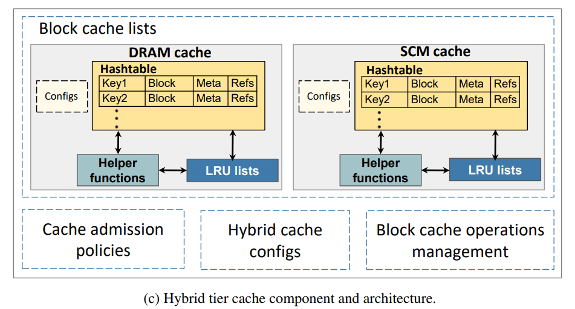

### 1、关于optane持久内存的两种模式：

#### 1.1、optane持久内存给定两种使用模式分别为内存模式和App Direct模式。

#### 1.2、内存模式：适用于大容量内存，并且该内存被视为易失性内存，因此不需要更改应用程序；App Direct 模式： 可以提供大容量内存，且被优化的应用可直接与作为第二层内存的PMem进行沟通。

- memory mode：

  ​		无需更改应用即可提供大内存容量，并且性能接近 DRAM，具体视工作负载而定。在内存模式下，CPU 内存控制器将所有英特尔® 傲腾™ 持久内存 200 系列视为易失性系统内存（无数据持久性）。CPU 将 DRAM 用作英特尔® 傲腾™ 持久内存的高速缓存。内存模式下，模组中的数据将通过单个加密密钥进行保护。该密钥在断电时会被丢弃，使数据不可访问。

  ​		与 DDR4 DRAM 相比，内存模式下持久内存的大内存容量能够以更低的成本支持更多虚拟机，并为每个虚拟机分配更多内存5。 I/O 依赖型工作负载也可以从内存模式中受益。因为与 DDR4 DRAM 相比，此种模式下的英特尔® 傲腾™ 持久内存 200 系列能够以更低的成本提供更大的容量，因而能够支持更大的数据集。随着内存容量的增加，虚拟机和应用的密度也得到提升， 第三代英特尔® 至强® 可扩展处理器的利用率也随之提高。

- App Direct mode：

  ​		能够实现大内存容量和数据持久性。这样软件就可以将 DRAM 和持久内存作为两个独立的内存池进行访问。在 App Direct 模式下，支持行业标准持久内存编程模型的软件 和应用能够直接与持久内存通信。直接访问降低了堆栈的复杂性并能充分利用具备缓存一致性和字节可寻址特点的持久内存， 这可将持久内存的使用扩展到本地节点之外，并能始终提供低时延，为处理更大的数据集提供支持。

  ​		此外，App Direct 模式还能与标准的文件 API 结合使用，以便访问相同的持久内存地址空间（这称为基于 App Direct 的存储模式），而无需对现有应用或原本需要块存储设备来支持的文件系统进行任何修改。在基于 App Direct 的存储模式下，英特尔® 傲腾™ 持久内存可用作高性能块存储，而不会产生将数据移入和移出 I/O 总线时造成的时延。

  ​		在 App Direct 模式下，数据将使用持久内存模组上存储于安全元数据区域的密钥进行加密。该密钥只能由英特尔® 傲腾™ 持久内存 200 系列的控制器访问。在断电时，持久内存模组将被锁定，需要使用密码来解锁和访问数据。如果需要重新利用或清空持久内存模组，可以利用安全加密擦除和 DIMM 覆写来避免此前的数据被意外访问。

### 2、Improving Performance of Flash Based Key-Value  Stores Using Storage Class Memory as a Volatile  Memory Extension

#### 2.1、本文是介绍如何采用属于NVM的optane内存来扩展DRAM与flash的key-value存储系统的cache。

#### 2.2、本文所做如下所示：

- 使用真实的生产工作负载用例，开发了新的db_bench配置文件来对RocksDB性能进行基准测试。
- 在RocksDB中设计并实现了新的混合分层缓存模块，可以根据内存特性分层管理基于DRAM和SCM的缓存，还开发了三个准入策略来处理该缓存的数据传输。
- 使用商用数据中心工作负载在DCPMM上评估缓存实现，比较了DRAM/SCM大小的服务器配置，确定了每种配置与现有平台相比的成本与性能。
- 使用小型DRAM和额外的SCM来匹配大型DRAM占用服务器的性能，同时降低生产环境中读取主导服务的TCO（total cost of ownership）。

#### 2.3、混合缓存模块的整体架构

**整体分为四大部分：**

- Block cache lists：块缓存存储被分成了hash table 中的缓存条目。每个缓存条目保存了一个键、数据块、元数据（e.g. 键大小、哈希、当前缓存使用情况以及缓存条目的引用计数），缓存块由多个键值对组成，在数据块中采取二分搜索来查找键值对。块的大小是可配置的，LRU列表维护evict规则所需要的条件。辅助函数用于增加引用、检查引用阈值、传输块、检查大小限制等等。块缓存只用于缓存只读数据，因此可以不必考虑脏数据。
- Cache admission policies：主要设计了三种准入策略
  - DRAM first admission policy：从flash中读取的块会被首先插入到DRAM缓存，如果满了然后根据LRU规则evict到SCM。在查找时，会先搜索DRAM和SCM，未找到再启动闪存读取。SCM满了根据LRU规则evict到flash。
  - SCM first admission policy：从flash中读取的块会被首先插入到SCM缓存，设定一个阈值，当SCM缓存条目中的外部引用大于阈值时，块被认为是热的，并将其移动到DRAM。在查找时，会先搜索DRAM和SCM，未找到再启动闪存读取。DRAM满了根据LRU规则evict到SCM，同理，SCM根据LRU规则evict到flash。
  - Bidirectional admission policy：该策略与第一个策略的区别在于，DRAM和SCM之间的数据交换由单向变成了双向。当SCM满了时，通过设定的阈值查看其外部引用是否超过阈值，超过则被传输到DRAM，否则传入flash。
- Hybrid cache configs：混合缓存配置由 RocksDB 在模块外部设置，包括指向所有块缓存配置的指针、块缓存的数量、id、缓存的层数和要使用的准入策略。
- Block cache operations management：该单元根据准入策略将外部 RocksDB 操作（e.g. 插入、查找、更新等）重定向到目标块缓存。 例如，它决定传入的插入请求是否应该进入 DRAM 或 SCM 缓存。 